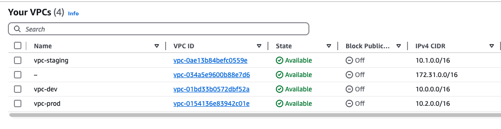
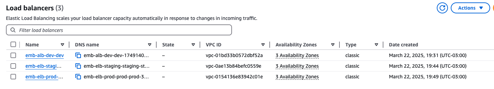
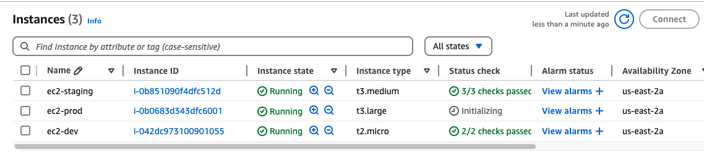

# Terraform Multi-Environment Setup

This project provides a Terraform configuration for setting up infrastructure across multiple environments (development, staging, and production) in AWS. It follows best practices for infrastructure as code, allowing for scalable and repeatable deployments.

## Features

- Multi-environment support (Dev, Staging, Prod)
- Amazon VPC setup with private and public subnets
- EC2 instance provisioning
- Elastic Load Balancer (ELB) configuration
- Secure access with Security Groups

## Project Structure

```
├── modules/                  # Reusable Terraform modules
│   ├── ec2/                  # EC2 module
│   ├── elb/                  # ELB module
│   ├── vpc/                  # VPC module
├── main.tf                   # Main configuration
├── providers.tf              # Provider configuration
├── variables.tf              # Variables configuration
├── terraform.tfstate         # State file (managed remotely)
├── terraform.dev.tfvars      # Dev vars file (managed locally)
├── terraform.staging.tfvars  # Staging vars file (managed locally)
├── terraform.prod.tfvars     # Prod vars file (managed locally)
├── README.md                 # Project documentation
```

## Prerequisites

- Terraform installed ([Install Guide](https://developer.hashicorp.com/terraform/tutorials/aws-get-started/install-cli))
- AWS CLI configured with appropriate credentials
- Remote backend (S3 + DynamoDB) for state management

## Setup and Deployment

1. Initialize Terraform:

   ```sh
   terraform init
   ```

2. Select the desired environment (e.g., `dev`, `staging`, or `prod`):

   ```sh
   terraform workspace new dev  # Change directory to the desired environment
   ```

3. Plan the deployment:

   ```sh
   terraform plan
   ```

4. Apply the deployment:

   ```sh
   terraform apply -var-file=terraform.dev.tfvars
   ```

5. Destroy the infrastructure if needed:

   ```sh
   terraform destroy
   ```

## AWS Architecture Overview

Below are the key AWS resources provisioned by this Terraform setup:

- **VPC**: A dedicated Virtual Private Cloud with private and public subnets
- **ELB**: Load balancer to distribute traffic
- **EC2**: Virtual machines for application workloads
- **Security Groups**: Firewall rules for secure access

## Infrastructure Diagram

_Replace the placeholders below with actual AWS architecture images_

**VPC Structure:**  


**ELB Structure:**  


**EC2 Instances:**  


## Best Practices Followed

- Modular Terraform code for reusability
- Remote backend for state management
- Environment separation to ensure isolated deployments
- Parameterized configurations for flexibility

## Future Enhancements

- Add auto-scaling for EC2 instances
- Implement IAM roles and policies for fine-grained access control
- Enhance monitoring with CloudWatch and logging setup

## 📝 License

This project is licensed under the MIT License - see the [LICENSE](LICENSE) file for details.

---

Made with ❤️ &nbsp;by Eduardo Bernardino 👋 &nbsp;[See my linkedin](https://www.linkedin.com/in/dudubernardino/)
